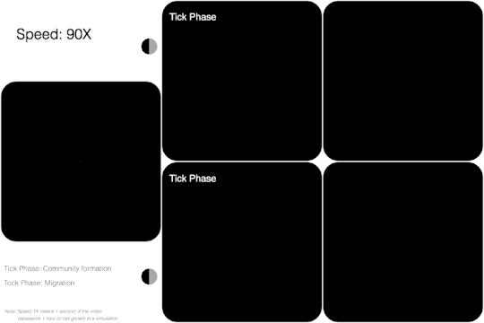
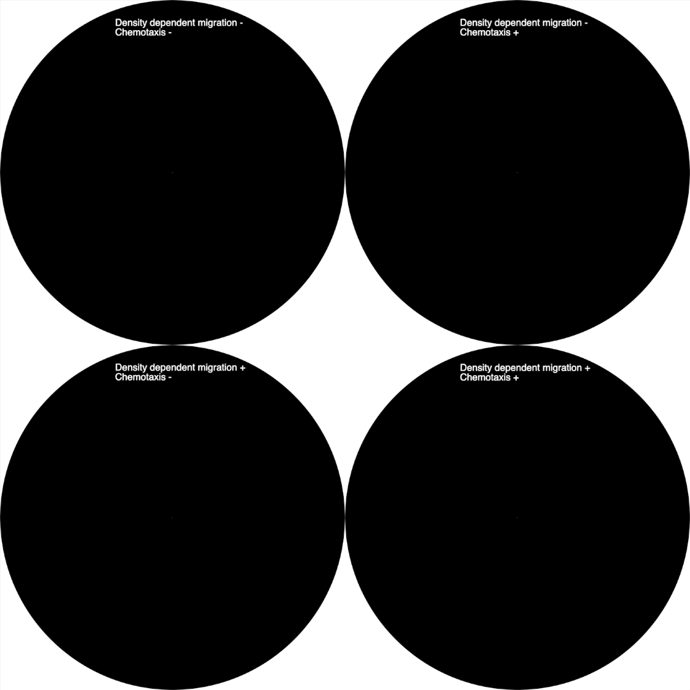
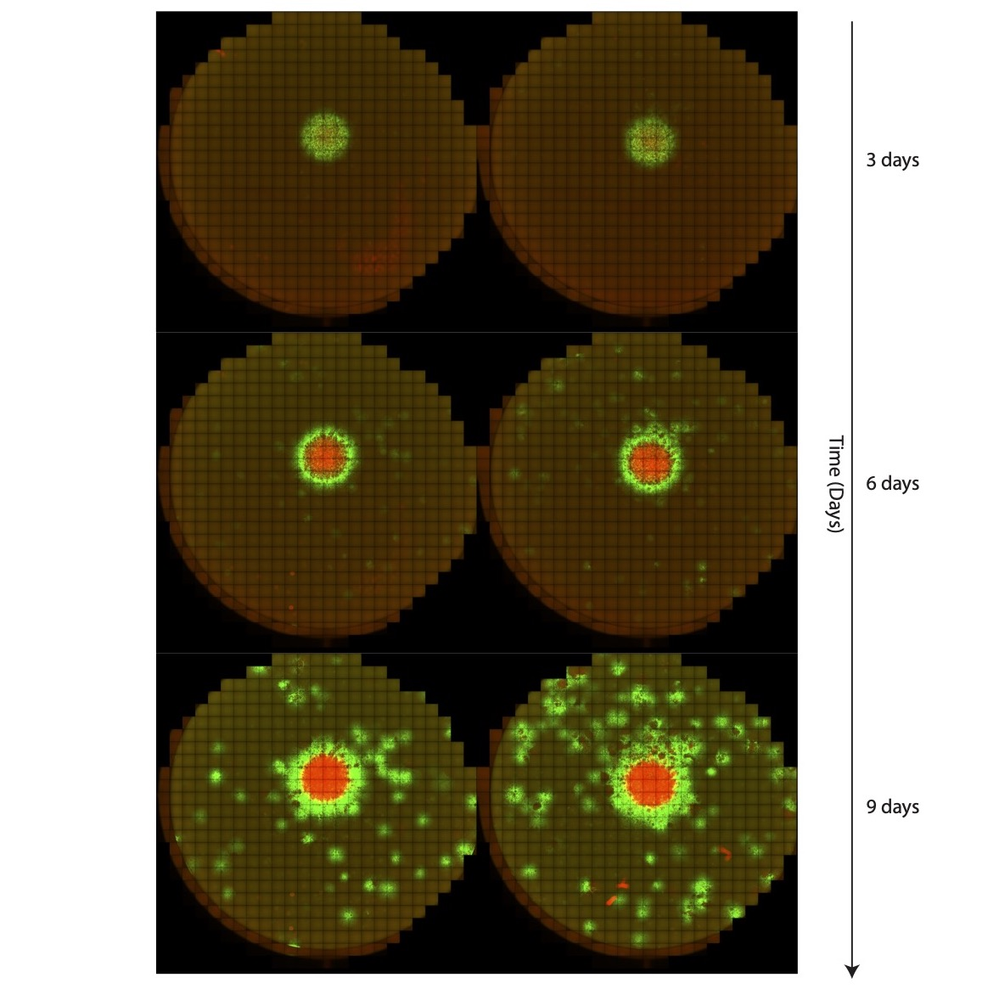

#  A Tick-Tock model of cancer growth

Cancer growth model with phenotypic trade-offs between proliferation and survival; colonization and competition.

Unfinished project. Any questions? contact me via taolee.lit@gmail.com.

Graphical abstract of a Tick-Tock model of cancer growth: 

Population initial growth with different parameters:

Single cell initial growth with different parameters:

Experimental observation of populationi initial growth:

