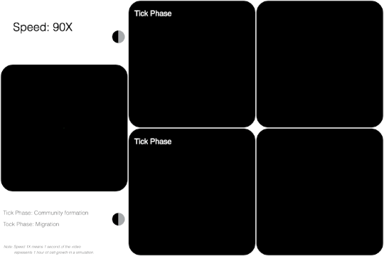
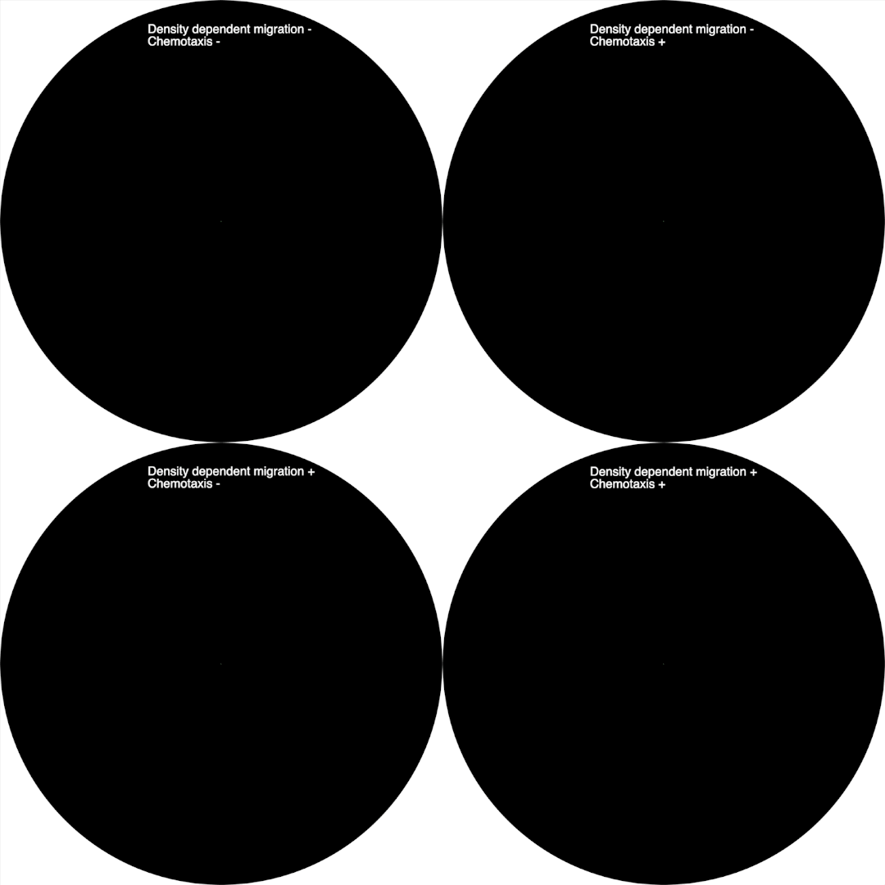
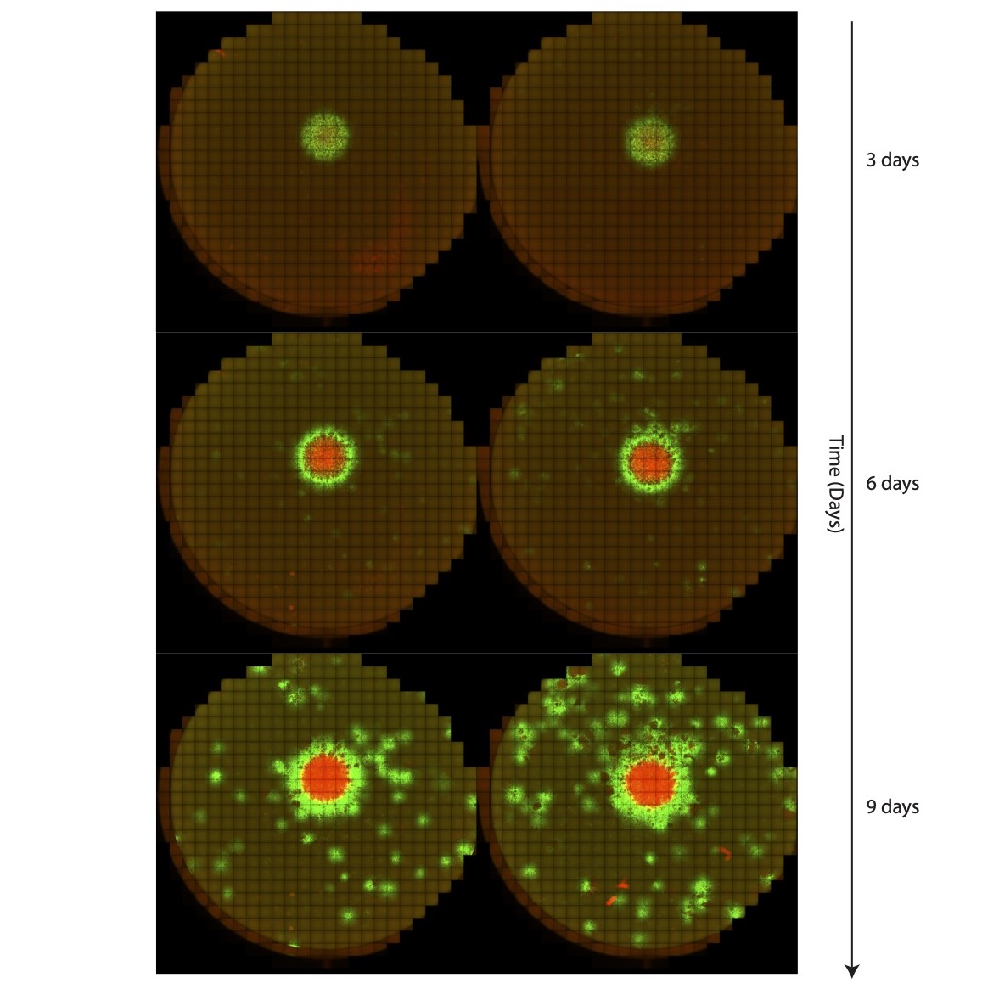

#  A Tick-Tock model of cancer growth


Cancer growth model with phenotypic trade-offs between proliferation and survival; colonization and competition.

The historical two-dimensional simulator remains available as `atcg`. The
separate `atcg3d` target implements sparse, event-driven three-dimensional
growth with dynamic angiogenesis, HDF5 checkpoints, VTK-HDF time-series output,
and ParaView/trame visualization. All 3D model and run parameters are supplied
through strict schema-v2 YAML; see
[`docs/3d_model_spec.md`](docs/3d_model_spec.md),
[`docs/3d_angiogenesis_spec.md`](docs/3d_angiogenesis_spec.md), and
[`docs/3d_benchmark.md`](docs/3d_benchmark.md).

```sh
cmake -S . -B build-3d -DCMAKE_BUILD_TYPE=Release \
  -DATCG_BUILD_LEGACY_2D=OFF -DATCG_BUILD_3D=ON \
  -DATCG3D_ENABLE_HDF5_CHECKPOINT=ON -DATCG3D_ENABLE_VTKHDF=ON
cmake --build build-3d --parallel
build-3d/atcg3d --config configs/atcg3d_legacy_2d_mapped_v2.yaml --dry-run
```

Graphical abstract of a Tick-Tock model of cancer growth: 




Population initial growth with different parameters:


Single cell initial growth with different parameters:




Experimental observation of populationi initial growth:




